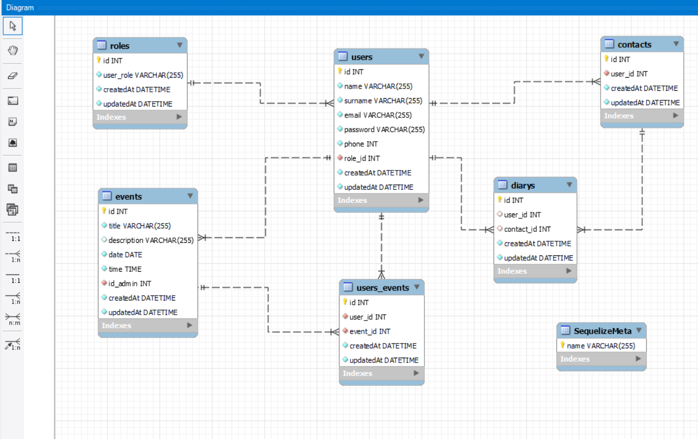

# Event Planner BackEnd


## About

El proyecto final se realizo con el fin de plasmar lo aprendido en el Bootcamp. Éste "Event Planner" es una aplicación que va a servir para organizar eventos de la mejor manera.

## Navegación por la web

Como users se podrán hacer estas acciones: 
<ol>
<li>Registrarse</li>
<li>Loggearse</li>
<li>Crear un evento</li>
<li>Ver los próximos eventos</li>
<li>Modificar eventos</li>
<li>Eliminar eventos</li>
<li>Eliminar una invitación a determinado evento</li>
<li>Ver su perfil</li>
<li>Ver su agenda de contactos</li>
<li>Agregar contactos a la agenda</li>
</ol>

Como admin ademas de las acciones anteriores: 
<ol>
<li>Puede ver todos los contactos registrados en la aplicación</li>
</ol>

---

## Stack
Tecnologías utilizadas:
<div>
</a>
<a href="https://www.expressjs.com/">
    
</a>
<a href="https://nodejs.org/es/">
    
</a>
<a href="https://developer.mozilla.org/es/docs/Web/JavaScript">
    
</a>
<a href="https://jwt.io/">
    
</a>
<a href="https://www.postman.com/">
    
</a>
<a href="https://www.mysql.com/">
    
</a>
<a href="https://www.github.com/">
    
</a>
<a href="https://git-scm.com/">
    
</a>
<a href="https://www.docker.com/">
    
</a>
<a href="https://www.sequelize.org/">
    
</a>
 </div>
 
 ---

 ## Diagrama de la Base de Datos
   

 ---

 ## Instalación 
1. Clonar el repositorio
2. ` $ npm install `
3. Conectamos nuestro repositorio con la base de datos 
4. ``` $ Ejecutamos las migraciones: npx sequelieze-cli db:migrate ``` 
5. ``` $ Ejecutamos los seeders: npx sequelize-cli db:seed:all ``` 
6. ``` $ npm run dev ``` 

---

## Endpoints

<details>
<summary>Endpoints</summary>

- AUTH

- REGISTRAR USUARIO

       POST http://localhost:3000/api/auth/register

  body:

  ```js
   {
       "nombre": "Luisito",
       "apellidos": "Comunica",
       "email": "luis@luis.com",
       "phone": "66678945",
       "password": "12345678"
   }
  ```

- LOGIN

       POST  http://localhost:3000/api/auth/login

  body:

  ```js
  {
      "email": "jose@correo.com",
      "password":"12345678"
  }
  ```

- USER

- PERFIL DE USER

        GET  http://localhost:3000/api/users/get-profile


- VER CONTACTOS

        GET  http://localhost:3000/api/users/get-my-contacts

- VER TODOS LOS USERS REGISTRADOS (RUTA DE ADMIN)

        GET  http://localhost:3000/api/users/get-all?page=1


- AGENDAR CONTACTO

       POST  http://localhost:3000/api/users/create-contact

  body:

  ```js
  {
      "phone": "692821554",
  }
  ```
- CREAR EVENTO

       POST  http://localhost:3000/api/event/create

  body:

  ```js
  {
        "title": "Cumpleaños de Lolo",
        "description": "Vamos a navergar en velero",
        "date": "2023-08-15",
        "time": "10:00:00"
  }
  ```


- MODIFICAR EVENTO

      PUT  http://localhost:3000/api/event/update-event/3

  body:

  ```js
  {
        "title": "REENCUENTRO",
        "date": "2023-07-07",
        "time": "12:00"
  }
  ```

- VER EVENTO

       GET  http://localhost:3000/api/event/get-events


- ELIMINAR EVENTO

      PUT  http://localhost:3000/api/event/delete-event/3

- ELIMINAR INVITACIÓN

       DELETE  http://localhost:3000/api/event/delete-invitation/2

- AGREGAR INVITADO AL EVENTO

       POST http://localhost:3000/api/event/add-guests/1

  body:

  ```js
    {
          "user_id": 5,
    }
  ```


## Contacto


**_Francisco Campana_**  
<a href="https://github.com/FranciscoCampana1" target="_blank"></a>

<a href="mailto:campanafrancisco1@gmail.com"></a>

<a href="https://www.linkedin.com/in/francisco-campana-06b946273/" target="_blank"></a>

</p>